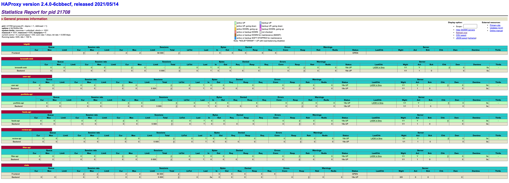

# HaProxy
This repo has haproxy configurations, where any services can be set behind the haproxy which act as a router/loadbalancer. Here haproxy will act any a interface to interact with any services.

- HTTPd services are spinned up inside the contianer to server the web traffic.
- This services are named as `lenswalk-webUI`, `lenswalk-user`, `lenswalk-portfolio`, `lenswalk-feeds`, `lenswalk-review`, `lenswalk-filter` respectively to mock the actual services.
- Each services are mapped to unqiue port to run the web services in localhost.

# Pre-Requisites
1. Docker
2. Haproxy

# Run Httpd Inside As Container Service
*Docker Commands to run Httpd Services in containers*

```
docker run -itd --name lenswalk-webUI -p 8081:80 -v htmls/lenswalk.html:/usr/local/apache2/htdocs/lenswalk/index.html httpd:2.4
docker run -itd --name lenswalk-user -p 8082:80 -v htmls/user.html:/usr/local/apache2/htdocs/user/index.html httpd:2.4
docker run -itd --name lenswalk-portfolio -p 8083:80 -v htmls/portfolio.html:/usr/local/apache2/htdocs/portfolio/index.html httpd:2.4
docker run -itd --name lenswalk-feeds -p 8084:80 -v htmls/feeds.html:/usr/local/apache2/htdocs/feeds/index.html httpd:2.4
docker run -itd --name lenswalk-review -p 8085:80 -v htmls/review.html:/usr/local/apache2/htdocs/review/index.html httpd:2.4
docker run -itd --name lenswalk-filter -p 8086:80 -v htmls/filter.html:/usr/local/apache2/htdocs/filter/index.html httpd:2.4
```


Upon the creation of the serives, following the are details of module & port respectively

| Module    | Location               |
| ----------| -------------------    |
| WebUI     | http://localhost:8081  |
| User      | http://localhost:8082  |
| Portfolio | http://localhost:8083  |
| Feeds     | http://localhost:8084  |
| Review    | http://localhost:8085  |
| Filter    | http://localhost:8086  |


## Run Haproxy:

```
haproxy -f haproxy-poc.cfg
```

## Haproxy Status

- Check the haproxy frontend & backend status at ```http://localhost:8080```



## Validation

### Web UI
```
http://localhost/lenswalk
```

### User Module
```
http://localhost/user
```

### Portfolio Module
```
http://localhost/portfolio
```

### Feeds Module
```
http://localhost/feeds
```

### Review Module
```
http://localhost/review
```

### Filter Module
```
https://localhost/filter
```
